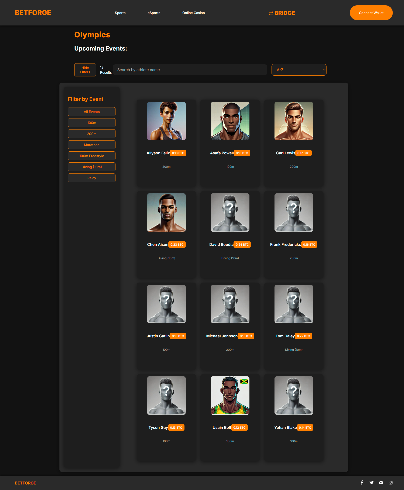
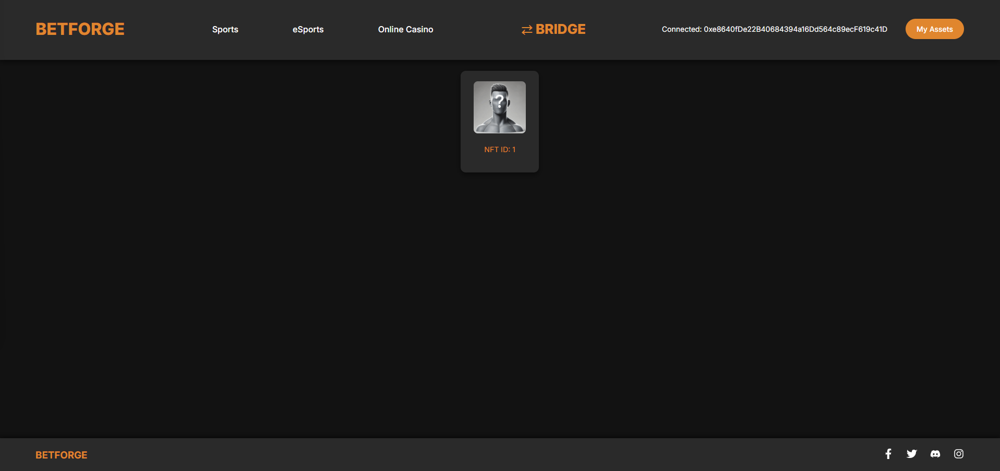
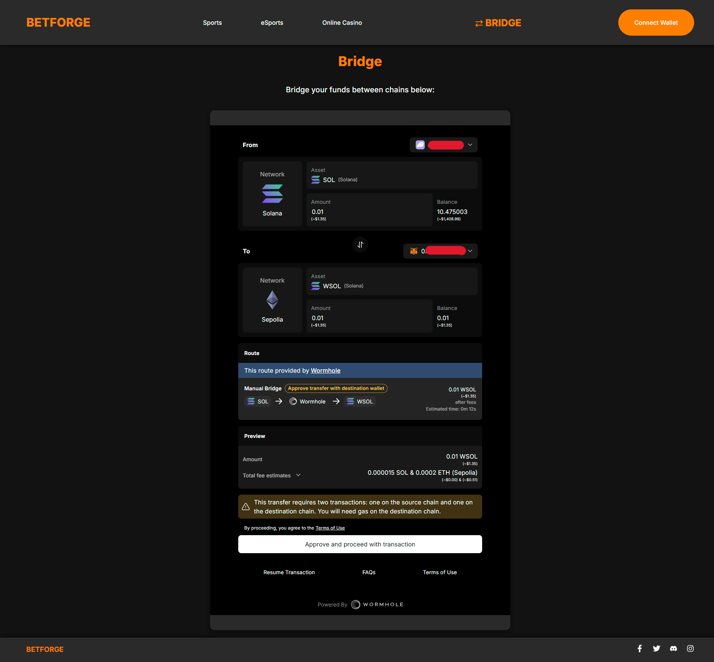

# BetForge

## Overview

BetForge is your all-in-one NFT sports betting platform, designed to bring the excitement of real-world events into the world of blockchain. By leveraging a multichain architecture and the power of Wormhole, BetForge allows users to mint, trade, and manage NFTs linked to real-world events across various blockchain networks.

## Key Features

- **Mint Event-Linked NFTs**: Users can mint NFTs tied to real-world events, with seamless bridging to the blockchain of their choice.
- **Cross-Chain NFT Marketplace**: List, buy, and sell NFTs across supported chains before, during, or after the outcome of the linked event.
- **Dynamic NFT Metadata**: NFT metadata is automatically updated based on event outcomes, which can enhance their value or trigger burning mechanisms.
- **Integrated Wormhole Connect**: Effortlessly transfer funds across chains with Wormhole Connect, ensuring a smooth cross-chain experience.
- **Future Betting Features**: Planned integration of real-time betting features for various games, expanding the platform's utility.

## Technologies

- **Wormhole Relayer**: Facilitates cross-chain communication for NFT activities, including minting, trading, and metadata updates.
- **Wormhole Connect**: Enables quick and efficient cross-chain fund transfers, enhancing the user experience.
- **Candy Machine (Solana)**: Utilized for minting NFTs and managing cross-chain bridges.
- **EVM Smart Contracts**: Deployed on Arbitrum, Ethereum, and Optimism, these contracts handle NFT minting, trading, and cross-chain messaging.

## Smart Contracts

- **Mint & Bridge NFTs**: Managed by the Candy Machine contract on Solana, ensuring efficient minting and bridging.
- **NFT Trading**: Contracts deployed on Arbitrum, Ethereum, Optimism, and Solana (future) facilitate the buying, selling, and listing of NFTs.
- **Cross-Chain Messaging**: EVM contracts handle cross-chain communication, with future expansion to Solana.
- **NFT Management**: Contracts on Arbitrum, Ethereum, and Optimism handle the minting and management of NFTs.

## How It Works

1. **Bet by Minting NFTs**: Users mint NFTs linked to real-world events on any supported chain.
2. **Automatic Bridging**: Upon purchase, NFTs are automatically bridged to the chain of the user's wallet.
3. **Trade NFTs**: Users can trade these NFTs across chains, before or after the event's outcome.
4. **Dynamic Metadata Updates**: The NFTs’ metadata will reflect the event outcome, either increasing in value if successful or being burned if not.

## Future Developments

- **Support for More Chains**: Expansion to additional blockchain networks to increase accessibility.
- **Dynamic Visuals**: Update NFT visuals alongside metadata based on event outcomes.
- **Real-Time Price Updates**: Reflect real-time prices according to the user's connected chain.
- **Online Casino**: An array of games for the user to bet their funds directly!

## Sustainable NFT Model

BetForge’s approach ensures that NFTs are only minted upon confirmed demand, minimizing unnecessary minting and reducing the risk of oversupply. This efficient model supports a sustainable and economically sound NFT marketplace.

## Getting Started

1. **Connect Your Wallet**: Make sure you have a wallet on any supported blockchain network.
2. **Mint or Buy NFTs**: Start by minting or purchasing event-linked NFTs.
3. **Trade & Transfer**: List your NFTs for sale or transfer funds across chains using Wormhole Connect.
4. **Monitor Event Outcomes**: Watch as the NFT metadata updates based on real-world event outcomes.

---

BetForge is redefining NFT sports betting by integrating real-world events with blockchain technology, offering users a unique and dynamic experience. Join us in this exciting journey and be part of the future of sports betting.

## Screenshots

### Buy/Mint NFTs

### View Assets

### Bridge Funds

